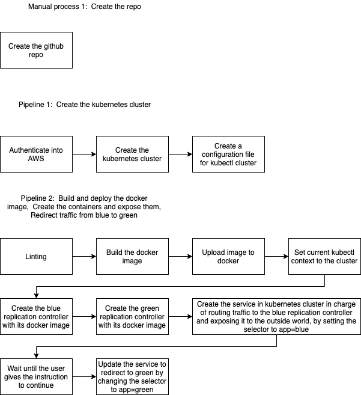
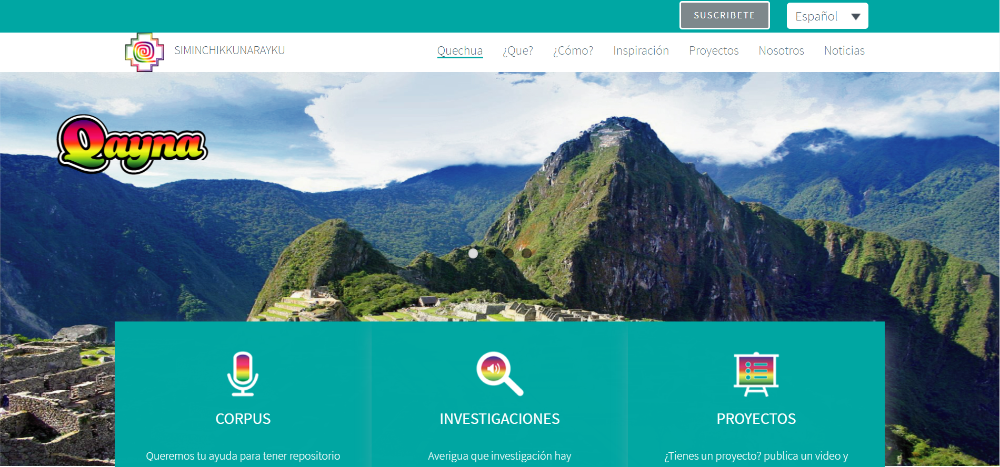

# Project 5 - Cloud DevOps Engineer Capstone Project

> In this project, I applied my skills and knowledge which was developed throughout the Cloud DevOps Nanodegree program.

## Project Tasks:

* Working in AWS
* Using Jenkins to implement Continuous Integration and Continuous Deployment
* Building pipelines
* Working with CloudFormation to deploy clusters
* Building Kubernetes clusters
* Building Docker containers in pipelines

## About Project: 

> I created a CI/CD pipeline for a basic website that deploys to a cluster in AWS EKS which is Blue/Green Deployment.



## Project Requirement:

> To be able to use this CI/CD pipeline you will need to install:

* Jenkins
* Blue Ocean Plugin in Jenkins
* Pipeline-AWS Plugin in Jenkins
* Docker
* Pip
* AWS Cli
* Eksctl
* Kubectl

## The files included are:
```sh
* /Images-of-result-deploy : Screenshot the result of deploy.
* /Create-clusters-pipeline : CloudFormation Script of Cluster Pipeline file 
* /Deploy-containers-pipeline : Deployment Script of Containers Pipeline file
* Jenkinsfile : Jenkinsfile for Creating Pipeline
* Dockerfile : Dockerfile for building the image 
* green-controller.json : Create a replication controller green pod
* green-service.json : Create the green service
* blue-controller.json : Create a replication controller blue pod
* blue-service.json : Create the blue service
* index.html : Web site Index file.
```

## Run the project:
```sh
* Please follow to steps of screenshot in Images-of-result-deploy folder.
```
https://medium.com/@andresaaap/capstone-cloud-devops-nanodegree-4493ab439d48
https://docs.aws.amazon.com/eks/latest/userguide/getting-started-eksctl.html
https://medium.com/@andresaaap/jenkins-pipeline-for-blue-green-deployment-using-aws-eks-kubernetes-docker-7e5d6a401021

# SiminchikkunaraykuWeb




The site is open source and is a web page to save the native communities from Peru.

### What do we do?

The mission of Siminchikkunarayku is to preserve and protect languages at risk of extinction, especially languages and to promote the public use of these languages through the creation and/or use of information and communication technologies,especially the development of computational portability. The vision of Siminchikkunarayku is that all communities of language speakers at risk of extinction, especially the South American languages, have the technological means to support and spread their language. If we lose our tongues we will lose a great treasure, on the contrary if our tongues flourish they will bring great benefits to the entire Nation, products and services valued at various points of GDP. As if that were not enough, the development of our languages will consolidate national inclusion and cohesion, ensuring sustainable and peaceful human development.

### How do we do it?

We bring together communities, researchers, writers, artists, engineers and universities from all over South America to gather and create the largest multimedia content to computationally process our ancient indigenous languages for the benefit of all.

### Who do I talk to?

Rodolfo Zevallos rjzevallos.salazar@gmail.com and Luis Camacho Caballero camacho.l@pucp.pe

